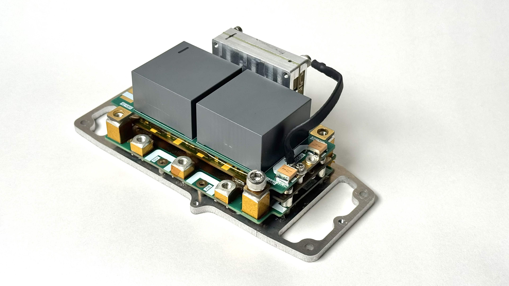

# Custom Voltage Source PMSM Inverter
600V 50kW Inverter Module for high-performance vehicle PMSM. Documentation is still a work in progress. Please ask me questions if you have any!
liongite12345@gmail.com

**Input Bus Voltage**: 750 V  
**Input Bus Current**: 100 A  
**Continuous Power**: 50 kW  
**Peak Power**: 80 kW  
**Continuous Output Current**: 100 Arms  
**Peak Output Current**: 140 Arms  
**Switching Frequency**: 10 - 20 kHz  
**Net Weight**: 0.6 kg  
**Net Volume**: 0.5 L  
**Power Density**: 150kW/L  
**Power Dissipation**: 600 W  
**Peak Efficiency**: >99.5%

